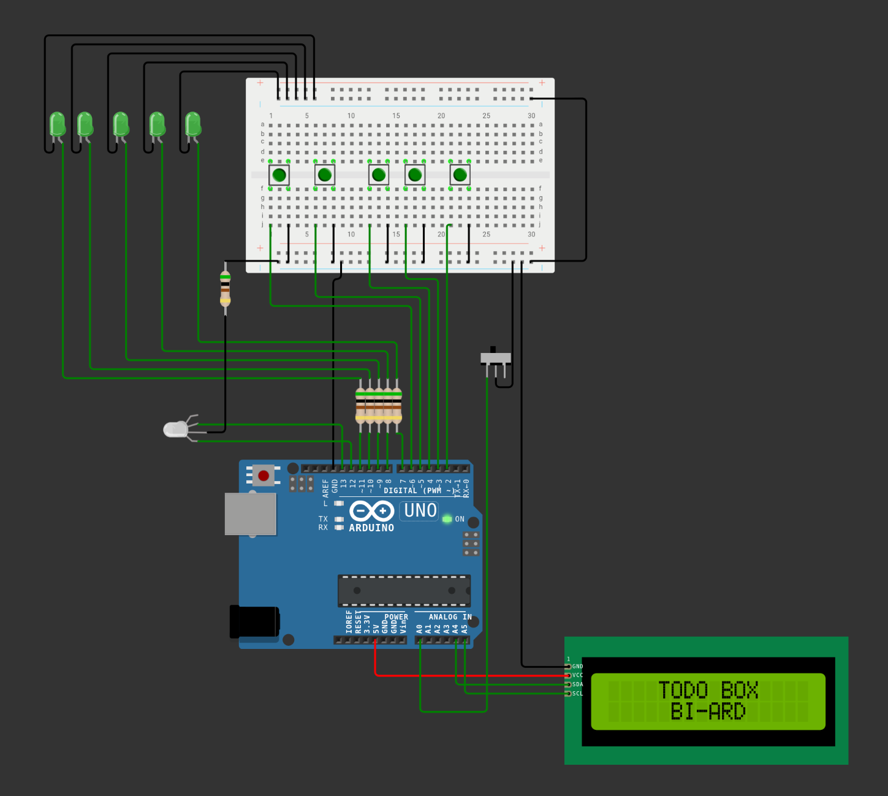
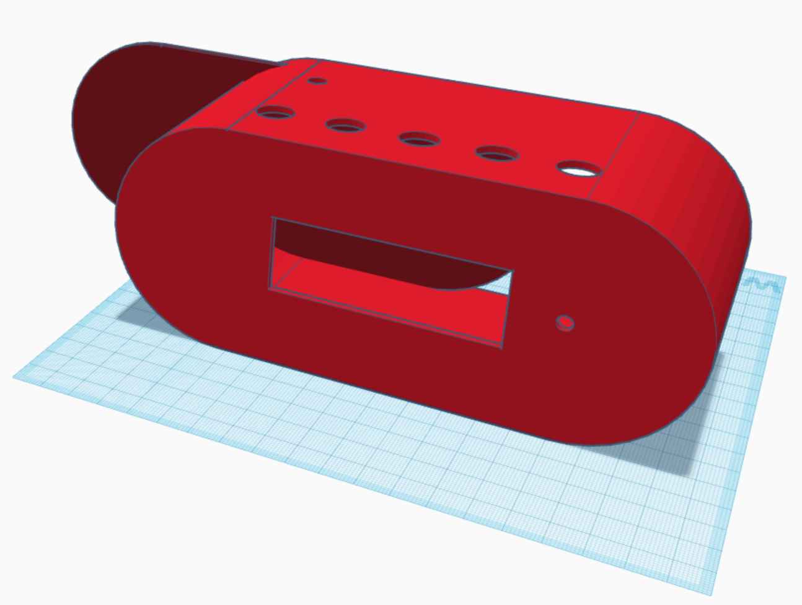
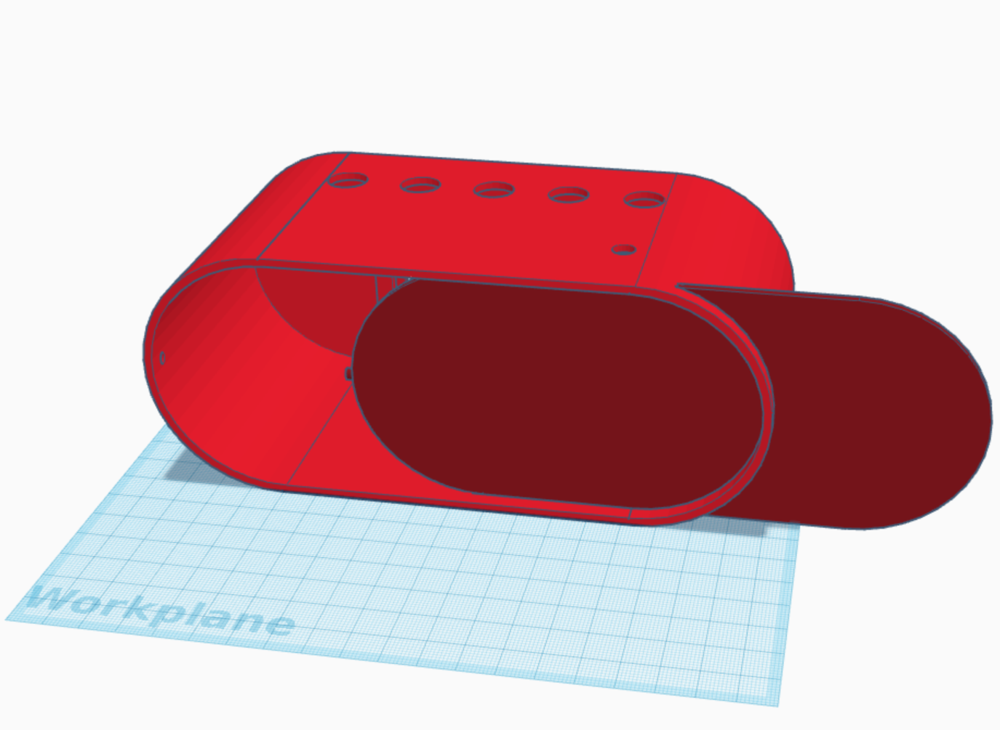

# Arduino Daily TODO Box

Kostrou projektu bylo spojit cca pět tlačítek a k nim příslušných LEDek. Ke každé jsem přiřadil nějaký úkol, který typicky dělám každý den, a když ho dokončím, zmáčknu tlačítko a LEDka se rozsvítí zeleně. Na konci dne pak vše zresetuju přepínačem, LEDky opět zhasnou a znovu mě motivují, abych je odklikával.

## Features

### 3D Box

Na 3D tiskárně vytisknutý box, ve kterém je uložen obvod a vidět jsou pouze tlačítka, LEDky, přepínač a displej.

### Ukládání dat

Informace o splněných úkolech se ukládají na zabudovanou persistentní EEPROM pamět. Z dat poté můžu vytáhnout jednoduché statistiky o úspěšnosti atd.

### Počítání úspěšnosti

Implemenovaný je počítač dnů, ve kterých jsem splnil všechny úkoly. Počítají se úspěšnosti i pro konkrétní úkoly.

### Zobrazení výsledků

Na připojený LCD 1602 displej se výše zmíněné statistiky po každém uložení promítnou. Po odprezentování opět zhasne.

### Animace po dokončení

Po dokončení úkolů se na displeji ukáže zpráva o úspěšném dokončení.

## Uživatelský manuál

Tento přístroj funguje jako počítadlo dnů, ve kterých člověk splnil všechny zadané úkoly.

- Po splnění úkolu člověk zmáčne příslušné tlačítko na vrchu krabice, načež se rozsvítí světýlko.
  - Pokud došlo k omylu, stačí ho zmáčnout znovu a vypne se.
- Na konci dne stačí přepnout přepínač a výsledky se uloží do persistentní paměti. Na displeji se promítne statistika souvislých dnů, ve kterých člověk splnil všechny úkoly. Potom i postupně u konkrétních dnů.
  - V tuto chvíli jsou tlačítka neaktivní, aby nedošlo k nějakému omylu (jako např. dvojnásobného uložení).
- Začíná nový den a znovu lze zaklikávat tlačítka.

## Teoretická příprava

### Zapojení Arduina

Pracoval jsem na Arduinu Leondardo, které mám doma k dispozici. Nejprve jsem zapojil obvod (viz přiložený model 'wiring.png') kde je 5 zelených ledek s rezistory a 5 tlačítek. Dále jsem zapojil jednu RG LEDku, která se přepíná na zelenou po dokončení všech úkolů. K uložení výsledků a resetování jsem připoji ještě jednoduchý přepínač s aretací. Nakonec stačilo zprovoznit LCD 1602 displej, opět viz přiložené schéma. EEPROM je již v Arduino Leonardo zabudovaný, tudíž jsem tam nemusel nic dělat.

### Model zapojení

### Zprovoznění ledek a tlačítek

V kódu budu muset zprovoznit všechny LEDky a tlačítka tak, aby stisknutí vždy přepnulo příslušnou ledku. K tomu nastavím check, že pokud jsou všechny zapnuté, bude svítit hlavní RG LEDka zeleně.

### Uložení výsledků a reset ledek

Složitější část bude ukládání výsledků. Po kliknutí na ukádací tlačítko se spustí funkce, která zapíše aktuální stav ledek do EEPROM paměti. Každá LEDka by byla reprezentovaná jedím bitem. Z těchto dat poté můžu případně vytáhnout nějaké statistiky.

Sérii dnů budu vždy přepočítávat z informací uložených v pamtěti a rovnou výsledek zobrazím. Poté se LEDky vypnou a jsou připraveny na další den.

### Zobrazení informací a výsledků

Abych se vyhnul zapojování dalších tlačítek pro ovládání (na které asi už ani nebude místo), by se mohl displej zapnout pouze po uložení výsledků, zobrazil by informace, a pak se zase vypnul. Bez možnosti ovládání. Zobrazila by se série dnů, a případně ještě nějaká animace nebo podpůrná hláška:)

### Vytisknutí 3D boxu

V Tinkercadu jsem namodeloval hrubý návrh krabičky, do které bych Arduino mohl uložit (viz přiložený screenshot box-model-front.png a box-model-back.png). Bude potřeba nejdřív všechno zapojit tak, jak to bude finálně, abych mohl odměřit rozměry atd. Možná bude problém s tlačítkama, které umím zapojit pouze do breadboardu.

### 3D Model

## Závěr

Díky semestrální práci jsem si mohl prohloubit znalosti v mnoha odvětvích (nejen) Arduina. Samozřejmostí byly záležitosti jako zapojování obvodu, vypočítávání odporu pro LEDky, práce s displejem nebo persistentní pamětí. Kromě toho jsem se ale naučil pájet, a opět si trochu připomenul proces 3D modelování, kalibrace tiskárny a samotný tisk.

Problém jsem měl s tlačítky, protože jsem je potřeboval mít připojené mimo breadboard. Nakonec jsem se rozhodl pro trochu komplikovanější řešení, tedy že si koupím tlačítka, která potom připájím k drátům, a budu si je moct umístit tam, kam budu chtít. S výsledkem jsem spokojený a jsem rád, že jsem v rámci předmětu dostal prostor pro realizaci vlastního projektu.
